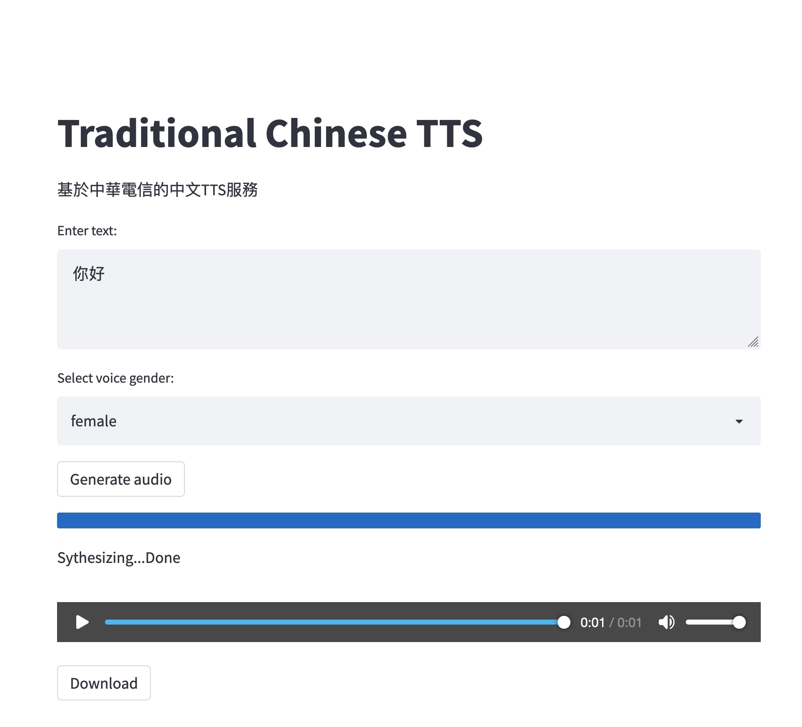

# 中文語音合成

使用 streamlit 應用程序構建一個簡單的 tts 演示頁面。

## 用法

-   在本地運行

    -   安裝依賴項：`pip install -r requirements.txt`
    -   應用 cht 密鑰：<https://iot.cht.com.tw/iot/developer>
    -   設置您的 api 密鑰：`export CHT_API_KEY="xxxx"`
    -   運行`streamlit run app.py`
-   部署於[streamlit.io](https://streamlit.io/)

    -   streamlit 由 Snowflake 支持[數據平台]
    -   將存儲庫 fork 到你的 github
    -   註冊到[streamlit.io](https://streamlit.io/)使用你的 github 帳戶
    -   點擊`New App`按鈕
    -   選擇分叉的存儲庫
    -   設置`Advanced Setting`
        -   選擇與`python 3.8`
        -   將 API_KEY 設置為秘密
                CHT_API_KEY = "your_api_key"
